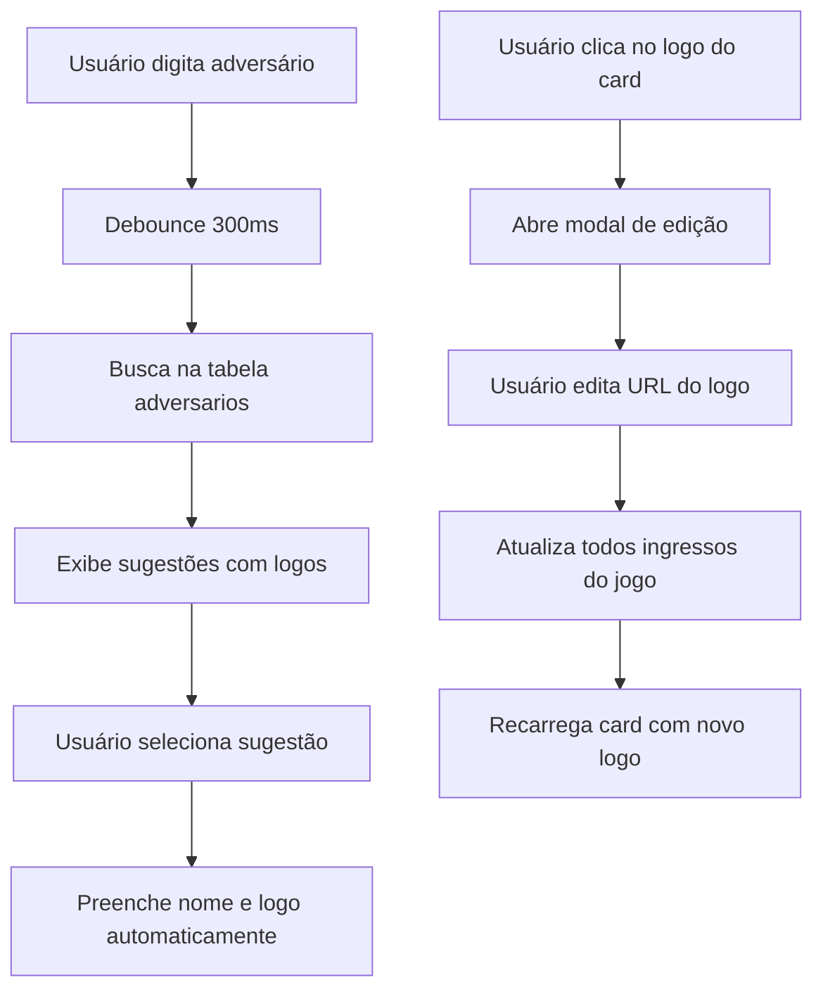

# Design: Busca Automática de Logos dos Adversários

## Visão Geral

Esta funcionalidade implementará duas melhorias principais no sistema de ingressos:
1. **Busca automática de adversários** no formulário de cadastro de ingressos
2. **Edição de logos** diretamente nos cards de jogos

A solução reutilizará a infraestrutura existente da tabela `adversarios` e seguirá os padrões já estabelecidos no sistema de viagens.

## Arquitetura

### Componentes Afetados

1. **IngressoFormModal.tsx** - Formulário de cadastro/edição de ingressos
2. **CleanJogoCard.tsx** - Card de exibição dos jogos
3. **useIngressos.ts** - Hook principal para gerenciamento de ingressos
4. **Novos componentes:**
   - `AdversarioSearchInput.tsx` - Input com busca automática
   - `EditarLogoModal.tsx` - Modal para edição de logos

### Fluxo de Dados



## Componentes e Interfaces

### 1. AdversarioSearchInput Component

```typescript
interface AdversarioSearchInputProps {
  value: string;
  onValueChange: (value: string) => void;
  onLogoChange: (logoUrl: string) => void;
  placeholder?: string;
  disabled?: boolean;
}

interface AdversarioSugestao {
  id: string;
  nome: string;
  logo_url: string;
}
```

**Funcionalidades:**
- Input com debounce de 300ms
- Dropdown com sugestões de adversários
- Preview dos logos nas sugestões
- Busca case-insensitive e parcial
- Cancelamento de requisições anteriores

### 2. EditarLogoModal Component

```typescript
interface EditarLogoModalProps {
  open: boolean;
  onOpenChange: (open: boolean) => void;
  jogo: JogoIngresso;
  onSuccess: () => void;
}
```

**Funcionalidades:**
- Modal para edição do logo do adversário
- Preview em tempo real da nova URL
- Validação básica de URL de imagem
- Atualização em lote de todos os ingressos do jogo

### 3. Atualizações no useIngressos Hook

```typescript
// Novas funções a serem adicionadas
const buscarAdversarios = useCallback(async (termo: string) => {
  // Busca na tabela adversarios com ILIKE
}, []);

const atualizarLogoJogo = useCallback(async (
  adversario: string, 
  dataJogo: string, 
  localJogo: string, 
  novoLogo: string
) => {
  // Atualiza logo de todos os ingressos do jogo específico
}, []);
```

## Modelos de Dados

### Tabela Existente: `adversarios`
```sql
-- Já existe, será reutilizada
CREATE TABLE adversarios (
  id UUID PRIMARY KEY DEFAULT gen_random_uuid(),
  nome VARCHAR NOT NULL,
  logo_url VARCHAR,
  created_at TIMESTAMP DEFAULT NOW(),
  updated_at TIMESTAMP DEFAULT NOW()
);
```

### Tabela Existente: `ingressos`
```sql
-- Campo logo_adversario já existe
-- Será atualizado via UPDATE em lote para jogos específicos
```

## Tratamento de Erros

### Busca de Adversários
- **Timeout**: Cancelar busca após 5 segundos
- **Erro de rede**: Falhar silenciosamente, permitir entrada manual
- **Sem resultados**: Mostrar mensagem "Nenhum adversário encontrado"

### Edição de Logos
- **URL inválida**: Mostrar preview de erro
- **Falha na atualização**: Exibir toast de erro e reverter alterações
- **Imagem não carrega**: Manter URL mas mostrar placeholder

## Estratégia de Testes

### Testes Unitários
1. **AdversarioSearchInput**
   - Debounce funcionando corretamente
   - Cancelamento de requisições anteriores
   - Exibição correta das sugestões

2. **EditarLogoModal**
   - Validação de URLs
   - Preview em tempo real
   - Atualização em lote

### Testes de Integração
1. **Fluxo completo de busca**
   - Digitar → buscar → selecionar → preencher
2. **Fluxo completo de edição**
   - Clicar logo → editar → salvar → atualizar

## Implementação Faseada

### Fase 1: Busca Automática no Formulário
1. Criar componente `AdversarioSearchInput`
2. Integrar no `IngressoFormModal`
3. Adicionar função de busca no `useIngressos`
4. Testes e ajustes

### Fase 2: Edição de Logos nos Cards
1. Criar componente `EditarLogoModal`
2. Adicionar clique no logo do `CleanJogoCard`
3. Implementar função de atualização em lote
4. Testes e ajustes

### Fase 3: Melhorias e Otimizações
1. Cache de adversários buscados
2. Melhorias na UX (loading states, animações)
3. Testes de performance
4. Documentação

## Considerações de Performance

### Cache e Otimizações
- **Cache local** de adversários buscados recentemente
- **Debounce** para evitar muitas requisições
- **Cancelamento** de requisições obsoletas
- **Lazy loading** das imagens de logo

### Limitações
- Máximo de 10 sugestões por busca
- Timeout de 5 segundos para buscas
- Cache limitado a 50 adversários

## Compatibilidade

### Sistemas Existentes
- **Sistema de viagens**: Compartilha a mesma tabela `adversarios`
- **Sistema de ingressos**: Mantém compatibilidade total
- **APIs existentes**: Não requer mudanças nas APIs atuais

### Migração
- Não requer migração de dados
- Funcionalidade é aditiva, não quebra funcionalidades existentes
- Rollback simples removendo os novos componentes