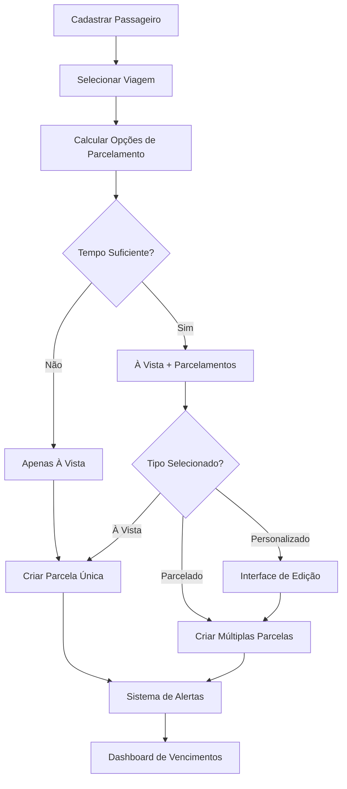
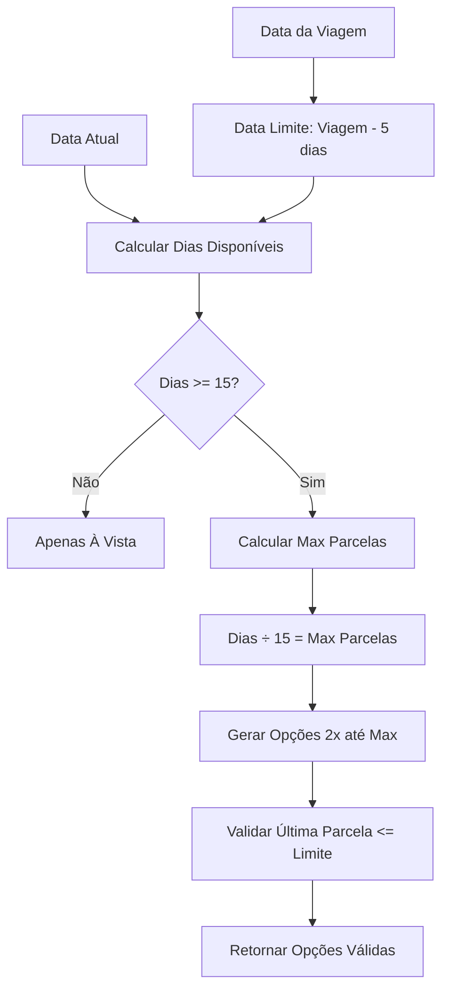
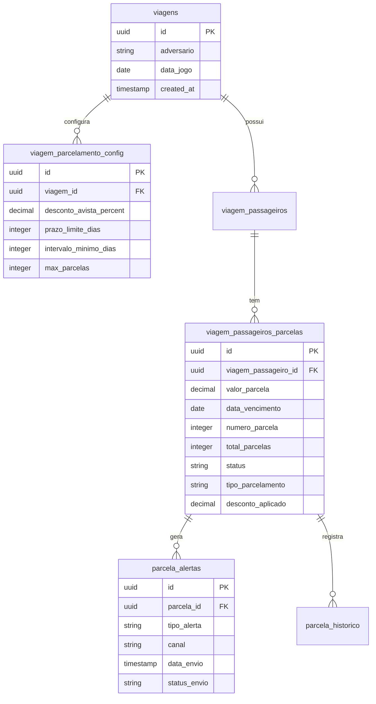

# Sistema de Parcelamento Inteligente - Design

## Overview

O Sistema de Parcelamento Inteligente é uma funcionalidade que automatiza a criação e gestão de parcelas para pagamentos de viagens, sempre respeitando a regra de negócio fundamental: **todos os pagamentos devem estar quitados até 5 dias antes da data da viagem**.

O sistema oferece três modalidades principais:
1. **Pagamento à Vista** - Com possível desconto, vencimento imediato
2. **Parcelamento Automático** - 2x, 3x, 4x+ calculado automaticamente
3. **Parcelamento Personalizado** - Datas e valores definidos manualmente

## Architecture

### Fluxo Principal


### Cálculo de Parcelamento


## Components and Interfaces

### 1. Calculadora de Parcelamento

**Responsabilidade**: Calcular opções de parcelamento baseado na data da viagem

```typescript
interface ParcelamentoCalculator {
  calcularOpcoes(dataViagem: Date, valorTotal: number, descontoAvista?: number): ParcelamentoOpcao[];
  validarParcela(dataVencimento: Date, dataViagem: Date): boolean;
  calcularIntervaloMinimo(): number; // 15 dias
}

interface ParcelamentoOpcao {
  tipo: 'avista' | 'parcelado';
  parcelas: number;
  valorParcela: number;
  valorTotal: number;
  desconto?: number;
  datas: Date[];
  descricao: string;
  valida: boolean;
}
```

### 2. Interface de Seleção

**Responsabilidade**: Permitir seleção e edição de parcelamento

```typescript
interface ParcelamentoSelector {
  opcoes: ParcelamentoOpcao[];
  opcaoSelecionada: ParcelamentoOpcao | null;
  modoEdicao: boolean;
  
  selecionarOpcao(opcao: ParcelamentoOpcao): void;
  editarData(indiceParcela: number, novaData: Date): void;
  validarEdicao(): boolean;
  confirmarParcelamento(): Parcela[];
}

interface Parcela {
  numero: number;
  totalParcelas: number;
  valor: number;
  dataVencimento: Date;
  status: 'pendente' | 'pago' | 'vencido' | 'cancelado';
  descricao: string;
}
```

### 3. Gerenciador de Alertas

**Responsabilidade**: Enviar alertas automáticos baseado em vencimentos

```typescript
interface AlertaManager {
  verificarVencimentos(): void;
  enviarAlerta(parcela: Parcela, tipo: TipoAlerta): void;
  gerarTemplate(parcela: Parcela, tipo: TipoAlerta): string;
  registrarEnvio(parcela: Parcela, alerta: Alerta): void;
}

type TipoAlerta = '5_dias_antes' | 'vencimento' | 'atraso_1dia' | 'atraso_7dias';

interface Alerta {
  id: string;
  parcelaId: string;
  tipo: TipoAlerta;
  canal: 'whatsapp' | 'email' | 'sms';
  template: string;
  dataEnvio: Date;
  status: 'enviado' | 'lido' | 'respondido' | 'erro';
}
```

### 4. Dashboard de Vencimentos

**Responsabilidade**: Visualizar e gerenciar parcelas por vencimento

```typescript
interface VencimentoDashboard {
  hoje: Parcela[];
  amanha: Parcela[];
  estaSemana: Parcela[];
  proximaSemana: Parcela[];
  atrasadas: Parcela[];
  
  filtrarPorStatus(status: StatusParcela): Parcela[];
  agruparPorUrgencia(): { urgente: Parcela[], atencao: Parcela[], normal: Parcela[] };
  cobrarParcela(parcela: Parcela): void;
  cobrarEmMassa(parcelas: Parcela[]): void;
}
```

## Data Models

### Estrutura de Banco de Dados

```sql
-- Configuração de parcelamento por viagem
CREATE TABLE viagem_parcelamento_config (
  id UUID PRIMARY KEY DEFAULT gen_random_uuid(),
  viagem_id UUID NOT NULL REFERENCES viagens(id),
  desconto_avista_percent DECIMAL(5,2) DEFAULT 0,
  prazo_limite_dias INTEGER DEFAULT 5,
  intervalo_minimo_dias INTEGER DEFAULT 15,
  max_parcelas INTEGER DEFAULT 6,
  created_at TIMESTAMP DEFAULT NOW(),
  updated_at TIMESTAMP DEFAULT NOW()
);

-- Melhoria na tabela de parcelas existente
ALTER TABLE viagem_passageiros_parcelas ADD COLUMN IF NOT EXISTS
  data_vencimento DATE NOT NULL DEFAULT CURRENT_DATE,
  numero_parcela INTEGER NOT NULL DEFAULT 1,
  total_parcelas INTEGER NOT NULL DEFAULT 1,
  status VARCHAR(20) DEFAULT 'pendente' CHECK (status IN ('pendente', 'pago', 'vencido', 'cancelado')),
  tipo_parcelamento VARCHAR(20) DEFAULT 'avista' CHECK (tipo_parcelamento IN ('avista', 'parcelado', 'personalizado')),
  desconto_aplicado DECIMAL(10,2) DEFAULT 0,
  valor_original DECIMAL(10,2),
  observacoes TEXT;

-- Sistema de alertas
CREATE TABLE parcela_alertas (
  id UUID PRIMARY KEY DEFAULT gen_random_uuid(),
  parcela_id UUID NOT NULL REFERENCES viagem_passageiros_parcelas(id),
  tipo_alerta VARCHAR(20) NOT NULL CHECK (tipo_alerta IN ('5_dias_antes', 'vencimento', 'atraso_1dia', 'atraso_7dias')),
  canal VARCHAR(20) DEFAULT 'whatsapp' CHECK (canal IN ('whatsapp', 'email', 'sms')),
  template_usado VARCHAR(100),
  mensagem_enviada TEXT,
  data_envio TIMESTAMP DEFAULT NOW(),
  status_envio VARCHAR(20) DEFAULT 'enviado' CHECK (status_envio IN ('enviado', 'lido', 'respondido', 'erro')),
  resposta_recebida TEXT,
  created_at TIMESTAMP DEFAULT NOW()
);

-- Histórico de alterações
CREATE TABLE parcela_historico (
  id UUID PRIMARY KEY DEFAULT gen_random_uuid(),
  parcela_id UUID NOT NULL REFERENCES viagem_passageiros_parcelas(id),
  acao VARCHAR(50) NOT NULL, -- 'criada', 'data_alterada', 'pago', 'cancelada'
  valor_anterior JSONB,
  valor_novo JSONB,
  usuario_id UUID, -- referência ao usuário que fez a alteração
  observacoes TEXT,
  created_at TIMESTAMP DEFAULT NOW()
);

-- Índices para performance
CREATE INDEX idx_parcela_vencimento ON viagem_passageiros_parcelas(data_vencimento, status);
CREATE INDEX idx_parcela_status ON viagem_passageiros_parcelas(status);
CREATE INDEX idx_alertas_data ON parcela_alertas(data_envio);
CREATE INDEX idx_alertas_status ON parcela_alertas(status_envio);
```

### Relacionamentos



## Error Handling

### Validações Principais

1. **Validação de Data Limite**
   - Última parcela não pode vencer após (data_viagem - 5 dias)
   - Erro: "Data de vencimento ultrapassa o prazo limite de 5 dias antes da viagem"

2. **Validação de Intervalo Mínimo**
   - Mínimo 15 dias entre parcelas
   - Erro: "Intervalo mínimo entre parcelas é de 15 dias"

3. **Validação de Valor**
   - Soma das parcelas deve ser igual ao valor total
   - Erro: "Soma das parcelas não confere com o valor total"

4. **Validação de Status**
   - Não permitir editar parcela já paga
   - Erro: "Não é possível editar parcela já paga"

### Tratamento de Erros

```typescript
class ParcelamentoError extends Error {
  constructor(
    message: string,
    public code: string,
    public field?: string
  ) {
    super(message);
  }
}

// Códigos de erro
const ERROR_CODES = {
  PRAZO_LIMITE_EXCEDIDO: 'PRAZO_LIMITE_EXCEDIDO',
  INTERVALO_MINIMO: 'INTERVALO_MINIMO',
  VALOR_INCONSISTENTE: 'VALOR_INCONSISTENTE',
  PARCELA_JA_PAGA: 'PARCELA_JA_PAGA',
  VIAGEM_MUITO_PROXIMA: 'VIAGEM_MUITO_PROXIMA'
};
```

## Testing Strategy

### Testes Unitários

1. **Calculadora de Parcelamento**
   - Teste com diferentes datas de viagem
   - Teste com valores diversos
   - Teste de validação de limites

2. **Validações**
   - Teste de prazo limite
   - Teste de intervalo mínimo
   - Teste de consistência de valores

3. **Sistema de Alertas**
   - Teste de geração de templates
   - Teste de agendamento de alertas
   - Teste de não duplicação

### Testes de Integração

1. **Fluxo Completo**
   - Cadastro → Parcelamento → Pagamento
   - Cadastro → Edição → Confirmação
   - Vencimento → Alerta → Cobrança

2. **Integração com Sistema Financeiro**
   - Parcelas → Contas a Receber
   - Pagamentos → Fluxo de Caixa
   - Relatórios → Dados Consolidados

### Cenários de Teste

```typescript
describe('Parcelamento Inteligente', () => {
  describe('Cálculo de Opções', () => {
    it('deve oferecer apenas à vista para viagem em 10 dias', () => {
      const dataViagem = addDays(new Date(), 10);
      const opcoes = calcularOpcoes(dataViagem, 800);
      expect(opcoes).toHaveLength(1);
      expect(opcoes[0].tipo).toBe('avista');
    });
    
    it('deve oferecer 2x, 3x para viagem em 60 dias', () => {
      const dataViagem = addDays(new Date(), 60);
      const opcoes = calcularOpcoes(dataViagem, 800);
      expect(opcoes.length).toBeGreaterThan(2);
      expect(opcoes.some(o => o.parcelas === 2)).toBe(true);
      expect(opcoes.some(o => o.parcelas === 3)).toBe(true);
    });
  });
  
  describe('Validações', () => {
    it('deve rejeitar parcela que vence após prazo limite', () => {
      const dataViagem = addDays(new Date(), 30);
      const dataVencimento = addDays(dataViagem, -3); // 3 dias antes (inválido)
      expect(() => validarParcela(dataVencimento, dataViagem))
        .toThrow('Data de vencimento ultrapassa o prazo limite');
    });
  });
});
```

## Performance Considerations

### Otimizações

1. **Cálculo de Parcelamento**
   - Cache de opções por viagem
   - Cálculo assíncrono para não bloquear UI

2. **Dashboard de Vencimentos**
   - Índices otimizados por data_vencimento
   - Paginação para grandes volumes
   - Atualização incremental

3. **Sistema de Alertas**
   - Job assíncrono para verificação
   - Batch processing para múltiplos alertas
   - Rate limiting para evitar spam

### Monitoramento

- Tempo de cálculo de parcelamento
- Taxa de sucesso de alertas
- Performance de queries de vencimento
- Volume de parcelas por período

## Security Considerations

### Controle de Acesso

- Apenas usuários autorizados podem criar/editar parcelamentos
- Log de todas as alterações com identificação do usuário
- Validação de permissões por viagem

### Auditoria

- Histórico completo de alterações
- Rastreabilidade de alertas enviados
- Backup de configurações de parcelamento

### Validação de Dados

- Sanitização de inputs de data e valor
- Validação de limites de negócio
- Prevenção de manipulação de parcelas pagas